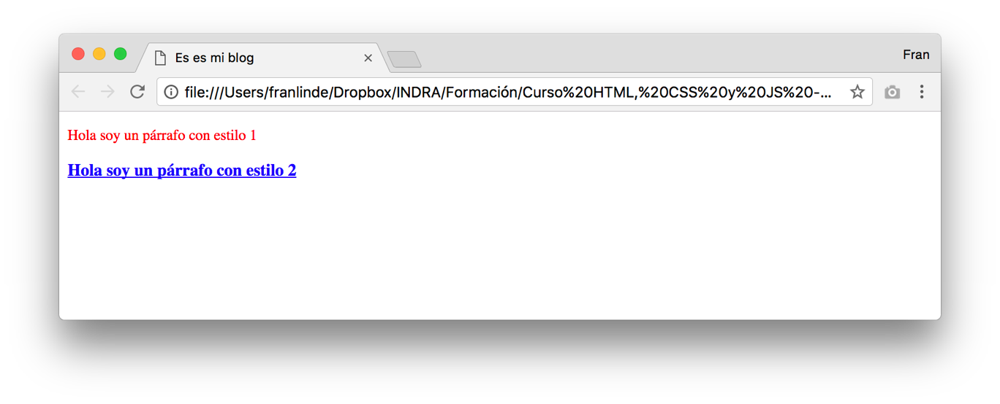
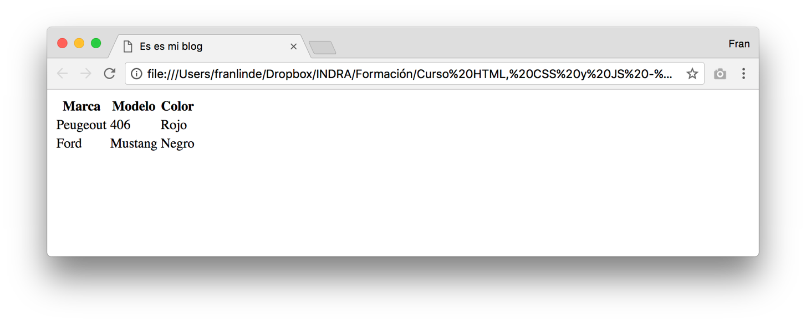
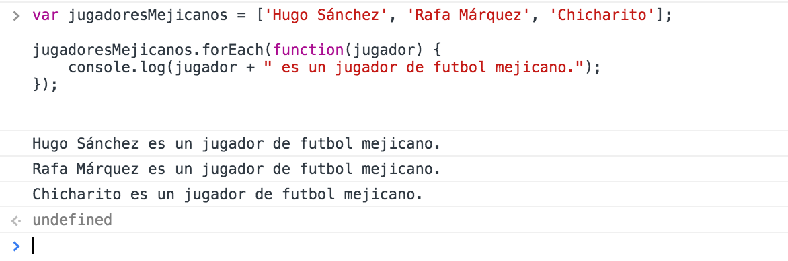

#### Curso HTML, CSS y JavaScript

# Tema 1: Introducción a JavaScript

# ÍNDICE

[Tema 1: Introducción a JavaScript 1](#tema-1-introducción-a-javascript)

[1. Introducción 4](#introducción)

[2. Cómo incluir JavaScript en una página 5](#_Toc485978745)

[2.1 Entre etiquetas `<script>` 5](#entre-etiquetas-script)

[2.2 Importando un fichero JavaScript externo 6](#importando-un-fichero-javascript-externo)

[3. Comentarios en JavaScript 7](#comentarios-en-javascript)

[4. Operaciones en JavaScript 8](#operaciones-en-javascript)

[5. Comparaciones en JavaScript 10](#comparaciones-en-javascript)

[6. Operadores lógicos 12](#operadores-lógicos)

[6.1 AND (&&) 12](#and)

[6.2 OR (||) 12](#or)

[6.3 Not (!) 13](#not)

[7. Instrucciones básicas de JavaScript 14](#instrucciones-básicas-de-javascript)

[7.1 La instrucción "if" 14](#la-instrucción-if)

[7.2 La instrucción "if-else" 16](#la-instrucción-if-else)

[7.3 La instrucción o bucle "while" 17](#la-instrucción-o-bucle-while)

[7.4 La instrucción o bucle "for" 18](#la-instrucción-o-bucle-for)

[7.5 La instrucción switch-case 19](#la-instrucción-switch-case)

[8. Funciones en JavaScript 21](#funciones-en-javascript)

[8.1 Funciones sin argumentos 21](#funciones-sin-argumentos)

[8.2 Funciones con un argumento 21](#funciones-con-un-argumento)

[8.3 Funciones con múltiples argumentos 22](#funciones-con-múltiples-argumentos)

[8.4 Funciones con "return" 23](#funciones-con-return)

[9. Tipos primitivos de datos en JavaScript 25](#tipos-primitivos-de-datos-en-javascript)

[10. Estructuras de datos en JavaScript 27](#estructuras-de-datos-en-javascript)

[10.1 Arrays en JavaScript 27](#arrays-en-javascript)

[10.2 Añadiendo elementos a un array en JavaScript 29](#añadiendo-elementos-a-un-array-en-javascript)

[10.3 Objetos en JavaScript 29](#objetos-en-javascript)

[10.4 For-in 31](#for-in)

[10.5 For-each 32](#for-each)

[11. Orden de las operaciones 34](#orden-de-las-operaciones)

[12. SetTimeout 35](#settimeout)

[13. SetInterval 36](#setinterval)

[14. Llamando a funciones JS desde HTML 38](#llamando-a-funciones-js-desde-html)

[14.1 Onclick 38](#onclick)

[14.2 Onload 39](#onload)

[14.3 Otros manejadores de eventos 39](#otros-manejadores-de-eventos)

[15. JSON en JavaScript 40](#json-en-javascript)

[15.1 JSON.stringify 40](#json.stringify)

[15.2 JSON.parse 41](#json.parse)

[16. Script defer/async 42](#script-deferasync)

[16.1 Defer 42](#defer)

[16.2 Async 43](#async)

[17. Tratamiento de errores 44](#tratamiento-de-errores)

[17.1 try / catch 44](#try-catch)

[17.2 Lanzando excepciones 45](#lanzando-excepciones)

# 1. Introducción

Durante este capítulo veremos una introducción a JavaScript, de manera
que más adelante podamos ir profundizando en las tres tecnologías más
importantes del desarrollo front-end: HTML, CSS y JavaScript.

JavaScript es el único lenguaje de programación que actualmente puede
ser ejecutado en los navegadores de forma nativa. Por lo que JavaScript
será el pilar de nuestros desarrollos Front-End.

# 2. Cómo incluir JavaScript en una página

El primer paso para poder empezar nuestras pruebas, es aprender a
incluir código JavaScript en nuestro HTML.

En JavaScript disponemos de varias formas de incluir código nuestra
página:

### 2.1 Entre etiquetas `<script>`

La manera "directa" de incluir y ejecutar JavaScript en nuestra página
es mediante la etiqueta `<script>`.

Podemos incluir estas etiquetas en cualquier lugar de nuestra página y
el navegador ejecutará las sentencias JavaScript dentro de ellas, en
cuanto las lea. Es recomendable que las etiquetas las incluyamos dentro
de la etiqueta `<head>` o antes de la etiqueta de cierre del body:
`</body>`

Veamos un ejemplo:

```html
<!DOCTYPE html>
<html>
  <head>
    <meta charset="utf-8" />
    <title>Es es mi blog</title>
    <link rel="stylesheet" type="text/css" href="blog.css" />
    <script type="text/javascript">
      alert("Hola clase!");
    </script>
  </head>
  <body>
    <p class="estilo1">Hola soy un párrafo con estilo 1</p>
  </body>
</html>
```

La función **"alert"** de JavaScript recibe un string o texto y genera
una alerta que se mostrará al usuario. Además, cabe destacar que la
función **"alert"** espera a que el usuario cierre la alerta para
continuar la ejecución del código.

### 2.2 Importando un fichero JavaScript externo

Mediante la etiqueta `<script>` que acabamos de ver, podemos también
incluir ficheros externos.

Esto nos permite tener nuestro código más organizado y reutilizar
nuestro JavaScript en otros documentos HTML. Ejemplo:

```html
<!DOCTYPE html>
<html>
  <head>
    <meta charset="utf-8" />
    <title>Es es mi blog</title>
    <link rel="stylesheet" type="text/css" href="blog.css" />
    <script type="text/javascript" src="blog.js"></script>
  </head>
  <body></body>
</html>
```

De la misma manera que sucede cuando incluimos ficheros CSS, la etiqueta
**"src"** nos sirve para indicar la ruta del fichero que queremos
importar, en este caso "blog.js".

En este ejemplo el fichero "blog.js" deberá estar en la misma carpeta
que el fichero index.html, ya que no se ha especificado ninguna ruta.

Dentro de "blog.js" podemos incluir código JavaScript directamente, por
ejemplo:

```javascript
var mensaje = "Hola, esto es un mensaje para imprimir en log";
console.log(mensaje);
```

Mediante el código anterior estamos definiendo una variable llamada
mensaje, en la que estamos almacenando un texto que posteriormente
imprimiremos en la consola JavaScript de nuestro navegador.

# 3. Comentarios en JavaScript

Una buena práctica en programación es incluir comentarios explicativos
en el código, de manera que cuando volvamos a leer nuestro código, o
cuando otra persona lo lea, sea capaz de entenderlo de un vistazo.

Los comentarios no son ejecutados por el navegador, sólo sirven como
aclaración para los programadores. Hay dos tipos de comentarios en
JavaScript:

- De una sola línea: comienzan con "//"
- De múltiples líneas: se escriben entre los siguientes símbolos:
  "/_" y "_/".

Por ejemplo:

```javascript
// Este es un comentario de una sola línea
alert("Hola clase!");
/*
Este es un comentario
con más de una
línea
*/
```

# 4. Operaciones en JavaScript

En JavaScript están soportadas todas las operaciones matemáticas
básicas: suma, resta, multiplicación, división, resto de división...
etc.

Veamos un ejemplo:

```javascript
var variable1 = 100;
var variable2 = 222;
var resultado = variable1 * variable2;
var mensaje = "El resultado es: " + resultado;
alert(mensaje);
```

Si incluimos este código en nuestro "blog.js" y visualizamos nuestra
página index.html en un navegador podremos ver el siguiente resultado:


Nuestro código ha definido dos variables "variable1" y "variable2",
posteriormente hemos multiplicado ambas y guardado el resultado en la
variable "resultado". Acto seguido hemos creado un mensaje concatenando
un texto (string) y el resultado de la operación de multiplicación.

Con este sencillo ejemplo hemos podido comprobar dos particularidades de
JavaScript:

1.  No es necesario "tipar" o definir el tipo de cada variable. Esto lo
    trataremos con más detalle más adelante, pero ya hemos podido
    comprobar cómo una variable puede almacenar cualquier tipo de valor,
    ya sea numérico o de texto.

2.  El operador de suma (+) sirve además de para sumar números, para
    concatenar variables. Si al operador de suma le enviamos una
    variable de texto, entonces actuará concatenando textos. Es un
    comportamiento muy peculiar y que da pie a muchas pruebas.

Podemos encontrar una lista completa con todos los operadores
disponibles en JavaScript en:
<https://www.w3schools.com/js/js_operators.asp>

# 5. Comparaciones en JavaScript

En JavaScript, al igual que en la mayoría de lenguajes tenemos
disponibles múltiples operadores para realizar comparaciones entre
variables. Los más comunes son:

- **==** se utiliza para comparar igualdad
- **===** se utiliza para comparar igualdad de valor y de tipo
- **!=** se utiliza para comprobar si dos variables son diferentes en valor
- **!==** se utiliza para comprobar si dos variables son diferentes en valor o en tipo
- **>** se utiliza para comprobar si una variable es mayor que otra
- **>=** se utiliza para comprobar si una variable es mayor o igual que otra

Ejemplo:

```javascript
var variable1 = 100;
var variable2 = 200;
var sonIguales = variable1 == variable2;
var var1EsMenor = variable1 < variable2;
console.log("¿Las variables son iguales?");
console.log(sonIguales);
console.log("¿La variable 1 es menor que la variable 2?");
console.log(var1EsMenor);
```

Nuevamente, si visualizamos nuestro **index.html** en un navegador y abrimos la consola JavaScript, veremos los siguientes mensajes:


# 6. Operadores lógicos

Al igual que en otros lenguajes en JavaScript encontramos operadores lógicos que nos permiten crear condiciones complejas. Existen 3 operadores lógicos en JavaScript:

### 6.1 AND (&&)

El operador and (y) nos permite agrupar dos expresiones. Traducido a
lenguaje natural sería como decir: "si la expresión 1 **y** la expresión
2 son ciertas...". AND devolverá true si ambas expresiones son **true,**
en cualquier otro caso devolverá false.

Veamos un ejemplo:

```javascript
var persona = {
  nombre: "Pedro",
  edad: 35
};
var ambasSonCiertas = persona.nombre == "Pedro" && persona.edad == 35;
if (ambasSonCiertas) {
  console.log("Se llama Pedro y tiene 35 años");
}
```

### 6.2 OR (||)

El operador or (o) nos permite agrupar dos expresiones. Traducido a
lenguaje natural sería como decir: "si la expresión 1 **o** la expresión
2 son ciertas...". OR devolverá true alguna de las dos expresiones es
**true,** en cualquier otro caso devolverá false.

Veamos un ejemplo:

```javascript
var coche = {
marca: "BMW",
modelo: "330",
caballos: 200
};

if(coche.marca = "Ferrari" || coche.caballos >= 180){
console.log("Tienes un buen coche");
}
```

### 6.3 Not (!)

El operador NOT devuelve el contrario de una expresión lógica. Si la
expresión es false, **"not"** devolverá true y viceversa. Puesto no sólo
podemos usar expresiones lógicas, si no que podemos usarlo sobre
variables. Veamos una definición que pueda ser aplicada a todas las
posibles variables:

NOT devolverá false si la expresión que recibe es true. Para cualquier
otro caso devolverá false.

Por este motivo **"NOT"** suele ser usado para comprobar si una función
existe o está definida.

Veamos un ejemplo:

```javascript
var ordenador = {
  marca: "HP",
  modelo: "Pavilion",
  procesador: "Intel i5",
  pantalla: false
};

if (!ordenador.pantalla) {
  console.log("Debes comprar una pantalla externa.");
}
```

En el ejemplo anterior hemos comprobado si la variable "pantalla" es
false mediante el uso de **NOT**. Aunque también nos sirve para
comprobar si no existe la variable pantalla:

```javascript
var ordenador = {
  marca: "HP",
  modelo: "Pavilion",
  procesador: "Intel i5"
};

if (!ordenador.pantalla) {
  console.log("Debes comprar una pantalla externa.");
}
```

El resultado en ambos casos es el mismo. Por este motivo el uso del
operador **NOT** está muy extendido, ya que permite comprobar si una
variable es false o no existe.

# 7. Instrucciones básicas de JavaScript

### 7.1 La instrucción "if"

Uno de los primeros pasos para empezar con cualquier lenguaje es conocer
las instrucciones condicionales. La más básica es **if,** y nos sirve
para ejecutar un bloque de código solo en caso de que se cumpla cierta
condición.

Por ejemplo:

```javascript
var nombreCiudad = "Madrid";
if (nombreCiudad == "Madrid") {
  console.log("La ciudad es fantástica!!");
}
```

El fragmento de código anterior "traducido" a lenguaje natural sería
algo así como: El nombre de la ciudad es Madrid. Si la ciudad es Madrid,
entonces di que la ciudad es fantástica.

Es bastante sencillo deducir qué va a pasar cuando ejecutemos este
código, aun así, vamos a probarlo.

Esta vez en vez de abrir nuestro documento **index.html**, vamos a
copiar y pegar este código en la **consola** **JavaScript** de nuestro
navegador. Podemos por ejemplo abrir Google Chrome y navegar a cualquier
página.

Para abrir la consola JavaScript en Google Chrome debemos hacer click en
Ver -> Opciones para Desarrolladores -> Consola JavaScript. En la
siguiente imagen puedes encontrar un ejemplo:



Una vez abierta, pegamos el código en ella y pulsamos la tecla enter o
intro de nuestro teclado, para que se ejecuten las instrucciones:


Podemos observar que el bloque de código dentro del **if** se ha
ejecutado, lo que indica que la condición **nombreCiudad == "Madrid"**
es cierta.

### 7.2 La instrucción "if-else"

Al igual que mediante la instrucción **if** podemos ejecutar un bloque
de código cuando una condición es cierta, también podemos hacer que se
ejecute otro bloque de código si la condición es falsa usando **else.**

Por ejemplo:

```javascript
var nombreCiudad = "Madrid";
if (nombreCiudad == "Barcelona") {
  console.log("¡La ciudad tiene playa!");
} else {
  console.log("Lo sentimos...La ciudad no tiene playa :(");
}
```

¿Qué pasará si ejecutamos este código en nuestro navegador? Vamos a
verlo:


Mediante la instrucción **if-else** podemos bifurcar nuestro código y
que se ejecuten unas instrucciones u otras en función de ciertas
condiciones que indicaremos dentro de los paréntesis del **if**.

### 7.3 La instrucción o bucle "while"

Mediante el bucle **while** (proveniente del inglés mientras) podemos
ejecutar un bloque de código mientras se cumpla cierta condición.

Por ejemplo: vamos a simular que tenemos una cuenta bancaria donde vamos
a ir depositando 10 dólares hasta que tengamos 100.

El código sería el siguiente:

```javascript
var ahorros = 0;
console.log("Comenzamos con " + ahorros + " dólares");
while (ahorros < 100) {
  ahorros = ahorros + 10;
}
console.log("Terminamos con " + ahorros + " dólares");
```

Y su ejecución en la consola de un navegador tendría el siguiente
resultado:


Podemos observar como la instrucción "ahorros = ahorros + 10" se ha
estado ejecutando hasta que la condición "ahorros < 100" ha pasado de a
ser falsa. Esto ha sucedido justo cuando ahorros valía 100.

### 7.4 La instrucción o bucle "for"

Otra instrucción muy útil es "**for".** Esta instrucción nos permite
ejecutar un determinado bloque de código repetidas veces en bucle.
Veámoslo con un ejemplo:

```javascript
var i = 0;
for (i = 0; i < 5; i++) {
  console.log("La variable i vale: " + i);
}
console.log("Ya ha terminado el bucle for");
```

Si ejecutamos este código en nuestra consola JavaScript veremos el
siguiente resultado:


¿Qué ha pasado? Vamos a verlo en detalle:

La instrucción **for** consta de 3 partes se paradas por punto y coma
(;)

1.  Primero realizamos una inicialización. Este apartado se ejecuta
    siempre antes de comenzar el bucle. En nuestro caso **i = 0**
2.  Después indicamos la condición que controlará que se siga ejecutando
    el bucle. Este no parará hasta que la condición sea falsa. En
    nuestro caso la condición es **i<5,** por lo que el bucle terminará
    cuando el valor de la variable **"i"** sea igual o mayor que 5
3.  Instrucción que se ejecutará cada vez que termine el bucle. En
    nuestro caso sumaremos 1 a i mediante la instrucción **i++**
    (equivalente a "i = i+1")

Se podría decir que la estructura de un bucle "for" es la siguiente:

```javascript
for (inicialización; condición; ejecutar después de cada ejecución) {
// bloque de código a ejecutar
// pueden ser múltiples líneas
}
```

Ejercicio: Trabaja con el bucle **for** cambiando las tres instrucciones
y comprobando el resultado. Ten cuidado con las condiciones o puedes
generar un bucle infinito.

### 7.5 La instrucción switch-case

En temas anteriores hemos visto varias instrucciones de programación en
JavaScriopt. Ahora es el turno de la instrucción **"switch".** Esta
instrucción ofrece una funcionalidad condicional, de la misma manera que
lo hacía la instrucción if, salvo que ahora podremos usar más de dos
condiciones.

La estructura de un switch case en JavaScript es la siguiente:

```javascript
switch (expresion) {
  case "valor 1":
    // bloque de código a ejecutar
    // si la expresión es igual a "valor 1"
    break;
  case "valor 2":
    // bloque de código a ejecutar
    // si la expresión es igual a "valor 2"
    break;
  default:
  // bloque de código a ejecutar
  // en caso de que no se ejecute
  // ningún otro bloque
}
```

La expresión dentro del switch se evalúa solo una vez, después se
recorren todos los casos comparando. En caso de econtrar un "caso" que
coincida con el valor de la expresión, se ejecutará el bloque de código
siguiente, hasta encontrar un **"break"** o terminar la instrucción
**switch**.

Siguiendo con la fución "saludar" que habíamos desarrollado durante el
tema 3, vamos a mejorarla añadiendo más posibilidades. Antes solo podía
aceptar un parámetro que indicaba si era por la tarde. Ahora haciendo
uso de switch podremos pasarle un parámetro con el momento del día que
es. Nuestra función tratará de reconocerlo con los casos "mañana",
"tarde" y "noche", en caso de no ser ninguno de estos tres, el switch
pasará por el bloque de código debajo de "default":

```javascript
function saludar(nombreDeLaPersona, momentoDelDia) {
  var mensajeDeSaludo = "";
  switch (momentoDelDia) {
    case "mañana":
      mensajeDeSaludo = "Buenos días " + nombreDeLaPersona;
      break;
    case "tarde":
      mensajeDeSaludo = "Buenas tardes " + nombreDeLaPersona;
      break;
    case "noche":
      mensajeDeSaludo = "Buenas noches " + nombreDeLaPersona;
      break;
    default:
      mensajeDeSaludo = "Hola " + nombreDeLaPersona;
      break;
  }
  alert(mensajeDeSaludo);
}
var nombre = "María y Sergio";
var momento = "mañana";
saludar(nombre, momento);
```

# 8. Funciones en JavaScript

Hasta ahora nuestro código JavaScript no estaba siendo empaquetado ni
organizado ni ninguna manera. Vamos a comenzar a separar nuestras
funcionalidades en porciones más pequeñas de código llamadas funciones.

Las funciones pueden ser independientes y realizar tareas de manera
autónoma, pero generalmente no lo son, ya que suelen dependen de su
entorno de ejecución o de parámetros que deben recibir, esto las
convierte en reutilizables.

### 8.1 Funciones sin argumentos

En algunas ocasiones necesitaremos cierta funcionalidad que no requiere
ningún argumento ni depende de ninguna condición o variable, como por
ejemplo cerrar la página.

Vamos a realizar una función muy sencilla que cuando sea llamada cerrará
la ventana:

```javascript
// Definición de la función cerrarVentana
function cerrarVentana() {
  window.close();
}
// Ejecutamos la función
cerrarVentana();
```

La definición de una función se realiza indicando la palabra
**"function"** seguida del nombre de la misma. Tras esto unos paréntesis
que indican los parámetros que recibirá (en este caso ninguno) y por
último encontramos el bloque de código a ejecutar entre llaves.

### 8.2 Funciones con un argumento

Vamos a realizar una función muy simple que se encargue de imprimir un
saludo personalizado con el nombre de la persona a la que queramos
saludar:

```javascript
function saludar(nombreDeLaPersona) {
  var mensajeDeSaludo = "Buenas tardes " + nombreDeLaPersona;
  alert(mensajeDeSaludo);
}
saludar("Álvaro Peña");
```

Como podemos observar, primero debemos definir la función. Nosotros
hemos llamado **"saludar"** a nuestra función y hemos indicado que
recibirá una variable con el nombre de la persona. Después debemos
ejecutarla enviándole el nombre de la persona a la que queremos saludar,
en este caso queremos saludar a Álvaro Peña.

Si ejecutamos nuestro código podemos observar que se muestra una alerta
del navegador con el mensaje "Buenas tardes Álvaro Peña"



### 8.3 Funciones con múltiples argumentos

Las funciones en JavaScript pueden recibir más de un parámetro, por
ejemplo: si queremos que nuestro saludo cambie si es por la mañana o por
la tarde, podemos añadir otro parámetro que lo indique:

```javascript
// Definición de la función saludar
function saludar(nombreDeLaPersona, esTarde) {
  var mensajeDeSaludo = "";
  if (esTarde) {
    mensajeDeSaludo = "Buenas tardes " + nombreDeLaPersona;
  } else {
    mensajeDeSaludo = "Buenos días " + nombreDeLaPersona;
  }
  alert(mensajeDeSaludo);
}
// Variables que vamos a enviar a la función
var persona = "Álvaro Peña";
var porLaTarde = false;
// Llamada a la función
saludar(persona, porLaTarde);
```

Cuando una función recibe más de un parámetro estos deben estar
separados por comas, como se puede observar en el ejemplo anterior.

### 8.4 Funciones con "return"

Las funciones además de ejecutar cierto bloque código, pueden generar
una respuesta que es devuelta al contexto que la ejecutó. El código
anterior era encargado de generar una alerta con un saludo. Podríamos
descomponer la funcionalidad en dos partes: la primera función se
encargará de generar el mensaje de saludo y la segunda de mostrarlo en
una alerta.

De esta manera hacemos nuestro código más modular y nos permitirá hace
una mayor reutilización del mismo. Por ejemplo, si quisiéramos mostrar
el mensaje en consola, podremos reutilizar el código que nos generaba el
mensaje de saludo:

```javascript
// Definición de la función generarMensajeDeSaludo
function generarMensajeDeSaludo(nombreDeLaPersona, esTarde) {
  var mensajeDeSaludo = "";
  if (esTarde) {
    mensajeDeSaludo = "Buenas tardes " + nombreDeLaPersona;
  } else {
    mensajeDeSaludo = "Buenos días " + nombreDeLaPersona;
  }
  return mensajeDeSaludo;
}
// Almacenamos lo que devuelve la función
var mensaje = generarMensajeDeSaludo();
// Mostramos una alerta con el mensaje
alert(mensaje);
// Y también mostramos mensaje por consola
console.log(mensaje);
```

El código anterior muestra el funcionamiento de la instrucción
**"return"** de una función, el cual devuelve el valor indicado y nos
permite guardarlo en una variable, en este caso **"mensaje".**

# 9. Tipos primitivos de datos en JavaScript

Aunque JavaScript no es un lenguaje fuertemente tipado, esto no quiere
decir que no existan tipos de datos. Vamos a ver los tipos primitivos
que existen en JavaScript:

- **String:** Nos permite almacenar cadenas de texto
- **Number:** Nos permite almacenar valores numéricos (tanto enteros
  como con decimales)
- **Boolean:** Representa un valor lógico: verdadero o falso (true ó
  false)
- **Null:** Es un tipo especial. Su contenido es "null".
- **Undefined:** Es una variable cuyo valor aún no se ha definido.
- **Object:** Contiene una referencia a un espacio en la memoria en el
  que encontramos una colección de propiedades. Lo veremos en detalle
  más adelante.

JavaScript es un lenguaje dinámico o de tipado débil, ya que no es
obligatorio indicar el tipo de una variable al definirlo. De hecho, una
misma variable puede cambiar de tipo sin problema alguno durante el
proceso de ejecución de nuestro código.

Podemos realizar pruebas haciendo uso de la función **"typeof"**, la
cual nos indicará el tipo de una variable en cada momento. Vamos a ello:

```javascript
var variable;
console.log("Valor: " + variable + " | Tipo: " + typeof variable);
variable = 10;
console.log("Valor: " + variable + " | Tipo: " + typeof variable);
variable = "texto";
console.log("Valor: " + variable + " | Tipo: " + typeof variable);
variable = true;
console.log("Valor: " + variable + " | Tipo: " + typeof variable);
variable = null;
console.log("Valor: " + variable + " | Tipo: " + typeof variable);
```

En el código anterior hemos definido una variable sin tipo y hemos ido
asignándole valores y comprobando su tipo en cada momento. Veamos el
resultado de ejecutar este código en una consola JavaScript:


Podemos observar cómo el tipo de variable ha pasado desde **undefined**
hasta **object** pasando por **number**, **string** y **boolean**.

# 10. Estructuras de datos en JavaScript

Los tipos de variables que hemos visto en el apartado anterior nos dan
cobertura prácticamente a todas nuestras necesidades. El problema lo
encontramos en cuanto el volumen de datos empieza a crecer y necesitamos
agrupar y estructurar la información.

Aquí es cuando entran los objetos y los arrays:

### 10.1 Arrays en JavaScript

Un array es un tipo de variable que nos permite agrupar un conjunto de
variables.

Los arrays se definen indicando el conjunto de variables que queremos
almacenar entre corchetes. Por ejemplo, vamos a definir un array con
nombres de países:

```javascript
var paises = ["Méjico", "España", "Chile", "Perú"];
console.log(paises);
```

Si ejecutamos este código en la consola JavaScript veremos el siguiente
resultado:


Para acceder a un elemento concreto del array se puede hacer mediante el
índice de la posición que ocupa indicado entre corchetes
(nombreDelArray[**posición**]), empezando a contar por el 0.

Por ejemplo:

```javascript
var paises = ["Méjico", "España", "Chile", "Perú"];
console.log("El primer país es: " + paises[0]);
console.log("El tercer país es: " + paises[2]);
```

Lo cual ejecutado en una consola JavaScript produce la siguiente salida:


Una propiedad muy útil de los arrays es **"length".** Mediante length
podemos conocer la longitud del array, lo cual combinado con un bucle
**"for"** nos permite recorrer todas sus posiciones:

```javascript
var paises = ["Méjico", "España", "Chile", "Perú"];
for (var indice = 0; indice < paises.length; indice++) {
  console.log("El país número " + indice + " es " + paises[indice]);
}
```

El anterior código genera la siguiente salida:


### 10.2 Añadiendo elementos a un array en JavaScript

En el ejemplo anterior hemos definido directamente el array con todo su
contenido, pero en muchas ocasiones esto no se adaptará a nuestras
necesidades. Son muchos los casos en los que debemos añadir elementos a
los arrays de forma dinámica.

Para ello disponemos de la función **"push"**. Vamos a ver cómo crear un
array vacío y posteriormente añadirle valores:

```javascript
var ordenadores = [];
ordenadores.push("HP EliteBook");
ordenadores.push("Macbook Pro");
ordenadores.push("Lenovo IdeaPad");
console.log(ordenadores);
```

Comprobamos que efectivamente este código añade elementos al array
"ordenadores".


### 10.3 Objetos en JavaScript

Los arrays de objetos son excelentes para guardar un conjunto de datos
del mismo tipo, cuyo índice no tiene relevancia alguna. Sin embargo, si
tuviéramos que guardar la información de una persona en un array,
probablemente fuera un desastre.

¿Dónde almacenaríamos cada propiedad? ¿Pondríamos el nombre en la
posición cero y los apellidos en la 1? ¿Tendríamos que acordarnos de en
qué posición está cada propiedad?

Los objetos nos solventan esta problemática, ya que cada una de las
posiciones o índices, tienen un nombre. De manera que el nombre de la
persona puede ser almacenado en **persona.nombre** y los apellidos en
**persona.apellidos** ¿Fácil verdad?

Vamos a ponerlo en práctica:

```javascript
// Definimos un objeto con los datos de una persona
var persona = {
  nombre: "Fran",
  apellidos: "Linde Blázquez",
  pais: "España",
  profesion: "Programador Front-End"
};
// Accedemos a sus propiedades
console.log("La persona se llama " + persona.nombre);
console.log("Y es " + persona.profesion);
```

Cabe destacar la manera en la definimos un objeto. A diferencia de los
arrays, debemos colocar sus elementos entre llaves ({ }) en vez de
corchetes ([ ]) y los elementos deben tener un nombre o índice que
colocamos delante de cada valor y separado de este con dos puntos.

El código anterior ejecutado en una consola produce el siguiente
mensaje:


En este ejemplo hemos accedido a las propiedades mediante la sintaxis
(**array.nombrePropiedad**), pero cabe destacar que también podríamos
haber usado esta otra sintaxis: (**array["nombrePropiedad"]**).

Aplicado al ejemplo anterior quedaría de la siguiente manera:

```javascript
// Definimos un objeto con los datos de una persona
var persona = {
  nombre: "Fran",
  apellidos: "Linde Blázquez",
  pais: "España",
  profesion: "Programador Front-End"
};
// Accedemos a sus propiedades
console.log("La persona se llama " + persona["nombre"]);
console.log("Y es " + persona["profesion"]);
```

Lo cual ofrecería el mismo resultado que el código anterior.

### 10.4 For-in

En el apartado de los arrays hemos visto cómo podemos recorrer todos sus
elementos mediante un bucle **for**. En el caso de los objetos, no sería
posible hacerlo del mismo modo, ya que los índices de acceso no son
siempre numéricos del 0 hasta su longitud -1.

Para poder recorrer los índices de un objeto JavaScript nos ofrece la
función **for in:**

Mediante la función **for in** podemos recorrer todos los índices del
objeto, de manera que podemos ir accediendo a cada una de sus
propiedades.

Por ejemplo:

```javascript
// Definimos un objeto con los datos de una persona
var persona = {
  nombre: "Fran",
  apellidos: "Linde Blázquez",
  pais: "España",
  profesion: "Programador Front-End"
};

// Recorremos todos sus índices
for (var indice in persona) {
  console.log("Persona tiene " + indice + " con valor: " + persona[indice]);
}
```

El código anterior produce el siguiente mensaje:


Es importante fijarse que hemos accedido a cada una de las propiedades
mediante "**persona[indice]"** y no mediante "**persona.indice".**
Esto se debe a que si hubiéramos accedido a "**persona.indice"**
estaríamos accediendo a la propiedad con nombre "indice", cuando lo que
queremos es acceder a la propiedad cuyo nombre es el valor de la
variable índice (por ejemplo nombre, apellidos... etc.).

### 10.5 For-each

El bucle forEach() ejecuta la función que recibe como parámetro, una vez
por cada elemento presente en el array (en orden ascendente). No es
invocada para índices que han sido eliminados o que no hayan sido
inicializados.

Veamos un ejemplo:

```javascript
var jugadoresMejicanos = ['Hugo Sánchez', 'Rafa Márquez',
'Chicharito'];
jugadoresMejicanos.forEach(function(jugador) {
console.log(jugador + " es un jugador de futbol mejicano.");
});
```

Lo cual ejecutado en una consola JavaScript produce el siguiente
resultado:



# 11. Orden de las operaciones

En JavaScript (al igual que otros muchos lenguajes) podemos realizar
operaciones matemáticas complejas, combinando varios operadores. Para
poder realizarlas debemos conocer de qué manera se combinan.

Para determinar qué operación se ejecuta primero es conviente conocer la
prioridad que JavaScript otorga a cada una de ellas. Vamos a realizar un
pequeño resumen ordenador de más prioritarias a menos:

1. Agrupación **()**
2. Incrementos/Decrementos **++** y **\--**
3. Operador lógico NOT **!**
4. Multiplicación, división y resto (*****, **/** y **%**)
5. Suma y resta (**+** y **-**)
6. Operadores lógicos mayor/menor (`<=, >=, >, <**)
7. Operadoradores lógicos de igualdad (**==**, **!=**)
8. AND (**&&**)
9. OR (**||**)

Ejercicio: Prueba a combinar las siguientes operaciones:

```javascript
var resultado = 100 * 400 - (20 * 400 % 10);
var resultado2 = 100>=400 && (typeof("hola") != "number");
```

¿Cuál debería ser el valor de resultado y resultado2?

# 12. SetTimeout

El método setTimeout() establece un temporizador que ejecuta una función
o una porción de código después de que transcurra el tiempo indicado en
milisegundos.

El valor devuelto por la función setTimeout() es númerico e identifica
el temporizador creado con la llamada a setTimeout(). Este valor puede
pasarse a la función clearTimeout() para cancelar el temporizador.

Veamos un ejemplo con código:

```javascript
// Variable que almacena el ID del timeout
var timeoutID;

// Función que crea el timeout
function mostrarSaludoDentroDeDosSegundos() {
  timeoutID = window.setTimeout(slowAlert, 2000);
}

// Función que muestra un alert

function slowAlert() {
  alert("Hola !!");
}

// Llamamos a la función que crea el timeout
mostrarSaludoDentroDeDosSegundos();
```

Si lo ejecutamos en la consola de nuestro navegador podemos observar
como la alerta se genera pasados 2000 milisegundos (2 segundos). Si
quisiéramos crear una función que cancelase el timeout antes de que se
ejecutase lo haríamos de la siguiente manera:

```javascript
// Función que cancela el timeout

function clearAlert() {
  window.clearTimeout(timeoutID);
}
```

# 13. SetInterval

Función muy parecida a la anterior salvo que su comportamiento se repite
en forma de bucle: **setInterval** ejecuta una función o un fragmento de
código que recibe por parámetro de forma repetitiva cada vez que termina
el periodo de tiempo determinado (también en milisegundos).

El valor devuelto por la función **setInterval()** es númerico e
identifica el temporizador creado con la llamada a **setInterval()**.
Este valor puede pasarse a la función **clearInterval()** para cancelar
el temporizador.

Veamos un ejemplo con código:

```javascript
// Variables que almacenan el ID del timeout y el tiempo que ha transcurrido
var intervalID;
var segundos = 0;

// Función que crea el timeout
function crearIntervaloDeUnSegundo() {
  intervalID = window.setInterval(imprimirAumentarTiempo, 1000);
}

// Función que muestra un alert

function imprimirAumentarTiempo() {
  segundos++;
  console.log("Tiempo: " + segundos + " s.");
}

// Llamamos a la función que crea el timeout
crearIntervaloDeUnSegundo();
```

Si ejecutamos el código en un navegador podemos observar que hemos
creado un contador de segundos:


Para para el intervalo debemos ejecutar la siguiente función:

```javascript
// Paramos el intervalo
clearInterval(intervalID);
```

# 14. Llamando a funciones JS desde HTML

Hasta ahora todo el código JavaScript que hemos generado se ejecutaba
"directamente" al cargar la página, pero con esto no conseguimos ofrecer
al usuario demasiada interacción.

Para cubrir nuestras necesidades de interacción podemos hacer uso de
eventos, que una vez detectados lancen las funciones que les indiquemos.
Los eventos más comunes son:

### 14.1 Onclick

Este evento se ejecuta cuando el usuario hace click en un elemento del
HTML. No tiene por qué ser un botón, puede ser cualquier elemento. La
manera más rápida de hacer uso de este evento es indicándolo sobre el
propio elemento mediante el atributo **onclick.**

Veamos su sintaxis con un pequeño ejemplo:

```html
<body>
  <p>Justo debajo encontramos un botón. Prueba a pulsarlo.</p>
  <button onclick="funcionalidadDeMiBoton()">Púlsame</button>
</body>
```

No debemos olvidarnos de definir nuestra función en nuestro fichero JS:

```javascript
function funcionalidadDeMiBoton() {
  alert("Acabas de hacer click en el botón.");
}
```

También podemos añadir estos eventos desde JavaScript sobre los
elementos que necesitemos. Esto lo trataremos más adelante en el tema
"Trabajando en el DOM con JavaScript".

### 14.2 Onload

El evento **onload** es lanzando cuando todos los elementos de nuestro
HTML han sido cargados. Es muy usado para ejecutar funcionalidades que
necesitan de elementos del documento. De esta manera nos aseguramos que
ya han sido cargados y no se producen errores.

Aunque la manera "tradicional" se realiza de la forma que hemos
explicado en el punto anterior: mediante el correspondiente atributo
(**onload**) sobre el elemento **body**, se recomienda hacerlo sobre la
variable **window** desde JavaScript:

```javascript
function laPaginaSeHaCargado() {
  alert("ya ha terminado la carga de la página");
}

window.onload = laPaginaSeHaCargado;
```

De esta manera estamos indicando al navegador que ejecute la función
"laPaginaSeHaCargado" cuando la página termine de cargar. Es muy común
encontrar también que directamente la funcionalidad a ejecutar se indica
mediante una función "al vuelo":

```javascript
window.onload = function() {
  // Insertar código aquí
  alert("La página ha terminado de cargar");
};
```

### 14.3 Otros manejadores de eventos

Puedes practicar con otros manejadores de eventos muy interesantes como
**"onMouseMove"** o **"onDrag"**. Podrás encontrar una lista completa
con todos los manejadores de eventos disponibles en:
<https://developer.mozilla.org/es/docs/Web/API/GlobalEventHandlers>

# 15. JSON en JavaScript

Un JSON es la representación de texto de un objeto JavaScript
serializado. Es muy común que se use para comunicación entre sistemas,
por ejemplo mediante una API.

Veamos un ejemplo. El siguiente objeto JavaScript:

```javascript
var objetoJavascript = {
  propiedad1: "Valor de la propiedad 1",
  propiedad2: "Valor de la propiedad 2",
  propiedad3: ["esto", "es", "un array"]
};
```

Tendría esta representación en JSON:

```javascript
{"propiedad1":"Valor de la propiedad 1","propiedad2":"Valor de la
propiedad 2","propiedad3":["esto","es","un array"]}
```

En JavaScript disponemos de dos métodos para transformar (serializar y
des-serializar) los JSON:

### 15.1 JSON.stringify

Dado un objeto JavaScript lo convierte a JSON (en un string):

```javascript
var representacionEnJson = JSON.stringify(objetoJavascript);
```

### 15.2 JSON.parse

Operación inversa a la anterior. Dado un string que contenga un JSON
válido, devuelve el objecto JavaScript correspondiente:

```javascript
var objetoJavascript = JSON.pase(representacionEnJson);
```

# 16. Script defer/async

Por defecto el flujo de ejecución de JavaScript en una página es el
siguiente:

1.  El navegador interpreta o parsea el HTML completo

2.  Descarga de los ficheros JS Externos

3.  Ejecución de los ficheros JS

4.  Paseo o renderizado del HTML de nuevo

Vamos a ilustrar el proceso con una imagen:


Este flujo produce generalmente problemas de rendimiento, por este
motivo durante la inclusión de un documento JavaScript en el **head** de
nuestro documento podemos hacer uso de dos atributo que indican de qué
manera debe ser cargado el documento:

### 16.1 Defer

El atributo **defer** indica que el script debe ser ejecutado cuando
termine de cargar la página, pero permite que la descarga del fichero se
realice en paralelo durante el parseo del HTML.

Veamos con un esquema cómo se ve afectado el proceso de carga de la
página con defer:


**Defer** solo puede usarse con scripts externos (cargados mediante
atributo **src**)

### 16.2 Async

El atributo **async** indica al navegador que puede descargar el
JavaScript y ejecutarlo en paralelo durante el parseo del documento
HTML. Hay que tener en cuenta que durante la ejecución del JavaSript no
tendremos el documento aún cargado.

Veamos de nuevo un esquema con el flujo de carga de la página, esta vez
con **async**:


# 17. Tratamiento de errores

En JavaScript, al igual que en otros lenguajes, los errores se tratan
mediante excepciones. Cuando la ejecución de una línea produce un error,
esta lanza una excepción.

Las excepciones se propagan de manera ascendente desde la última función
ejecutada, ascendiendo hasta la primera y esperando ser capturada en
algún punto.

### 17.1 try / catch

Para capturar una excepción debemos ejecutar el código dentro de la
sentencia try catach.

La declaración try\...catch marca un bloque de instrucciones para
intentar (try), y especifica una respuesta si se produce una excepción
(catch).

Veamos un ejemplo:

```javascript
try {
  // Definimos un JSON erroneo
  var jsonErroneo = "{ var: 123123, hola: ";
  // Tratamos de convertirlo a objeto (fallará)
  var json = JSON.parse(jsonErroneo);
  // Si no ha fallado nada deberíamos imprimir esta línea
  console.log("Hemos conseguido terminar el bloque try !!");
} catch (e) {
  console.log("No se ha podido ejecutar el bloque try !!");
  console.log("Excepcion:");
  console.log(e);
}
```

Somos conscientes de que el bloque del try es posible que falle, por eso
lo ejecutamos dentro de try catch. En este caso JSON.parse fallará y
lanzará una excepción que será recogida por el catch.

Si ejecutamos este código en un navegador el resultado es el siguiente:


### 17.2 Lanzando excepciones

Si en algún momento durante la ejecución de nuestro código quisiéramos
indicar que se ha producido un error, podemos lanzar de manera
voluntaria una excepción, que será tratada de la manera que hemos visto
en el punto anterior.

Para lanzar una excepción debemos ejecutar el siguiente código:

```javascript
// genera una excepción con un valor cadena
throw "Ha ocurrido un error";
```

Podemos enviar cualquier valor en la excepción, desde tipos primitivos
hasta objetos complejos.
